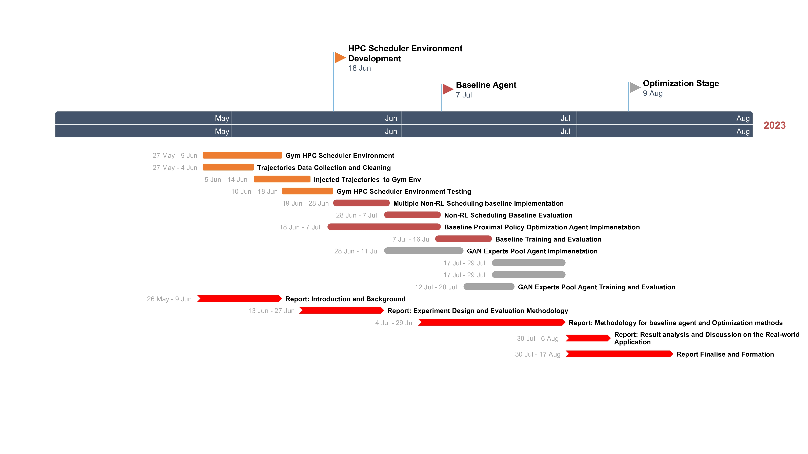

## Objectives and Goals

In this project, the main objective is to implement and evaluate some reinforcement learning agents that can be used to schedule jobs in a HPC environment. To enable agents to interact with the HPC job scheduling system, a gym scheduler is required to be implemented. The baseline agent will be trained using the Proximal Policy Optimization (PPO) algorithm. Then, we will use the previously proposed GAN architecture to train and compare. In the end, optimization methods regarding reward function improvement and network architecture optimization will be used in the experiment for analysis and evaluation.

## Project Plan

The initial project plan is shown in the following Gantt chart. The project plan is subject to change as the project progresses. The project plan is also subject to change based on the feedback from the supervisor.

There are 3 main milestones in the project plan. The first milestone is the development of the HPC scheduler environment in the OpenAI Gym. The second milestone is the development of the baseline agent. The third milestone is the optimization stage. The optimization stage is the stage where the baseline agent is optimized to achieve better performance. The optimization stage is divided into 2 parts. The first part is the reward function optimization experiment. The second part is the network architecture optimization experiment.

| Type      | Title                                                                | Start date | End date   | Duration (in days) |
| --------- | -------------------------------------------------------------------- | ---------- | ---------- | ------------------ |
| Task      | Gym HPC Scheduler Environment                                        | 05/27/2023 | 06/09/2023 | 14                 |
| Task      | Trajectories Data Collection and Cleaning                            | 05/27/2023 | 06/04/2023 | 9                  |
| Task      | Injected Trajectories to Gym Env                                     | 06/05/2023 | 06/14/2023 | 10                 |
| Task      | Gym HPC Scheduler Environment Testing                                | 06/10/2023 | 06/18/2023 | 9                  |
| Milestone | HPC Scheduler Environment Development                                | 06/18/2023 | 06/18/2023 | \-                 |
| Task      | Multiple Non-RL Scheduling baseline Implementation                   | 06/19/2023 | 06/28/2023 | 10                 |
| Task      | Non-RL Scheduling Baseline Evaluation                                | 06/28/2023 | 07/07/2023 | 10                 |
| Task      | Baseline Proximal Policy Optimization Agent Implmenetation           | 06/18/2023 | 07/07/2023 | 20                 |
| Task      | Baseline Training and Evaluation                                     | 07/07/2023 | 07/16/2023 | 10                 |
| Milestone | Baseline Agent                                                       | 07/07/2023 | 07/07/2023 | \-                 |
| Task      | GAN Experts Pool Agent Implmenetation                                | 06/28/2023 | 07/11/2023 | 14                 |
| Task      | GAN Experts Pool Agent Training and Evaluation                       | 07/12/2023 | 07/20/2023 | 9                  |
| Task      | Reward Function Optimization Experiment                              | 07/17/2023 | 07/29/2023 | 13                 |
| Task      | Network Architecture Optimization Experiment                         | 07/17/2023 | 07/29/2023 | 13                 |
| Milestone | Optimization Stage                                                   | 08/09/2023 | 08/09/2023 | \-                 |
| Task      | Report: Introduction and Background                                  | 05/26/2023 | 06/09/2023 | 15                 |
| Task      | Report: Experiment Design and Evaluation Methodology                 | 06/13/2023 | 06/27/2023 | 15                 |
| Task      | Report: Methodology for baseline agent and Optimization methods      | 07/04/2023 | 07/29/2023 | 26                 |
| Task      | Report: Result analysis and Discussion on the Real-world Application | 07/30/2023 | 08/06/2023 | 8                  |
| Task      | Report Finalise and Formation                                        | 07/30/2023 | 08/17/2023 | 19                 |
